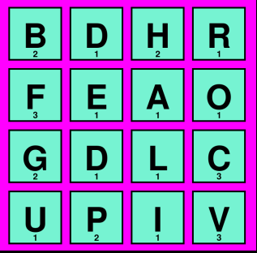
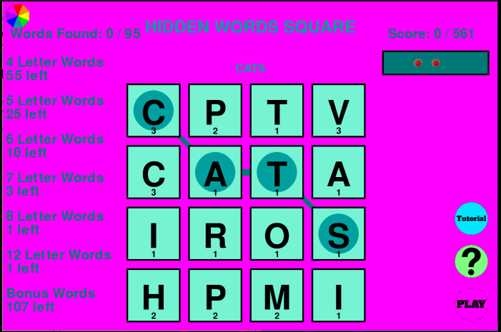

# Hidden Word Square
This is a fun word game where you try to find all of the normal words hidden in the letters.

## Reasons to play
*   **Fun challenging problems** While games might be easy, others might have you scratching your head trying to figure  out what the last few words are
*   **Colourful gameplay** There is a customizable colour theme that makes they game better suited to each player 

## How to play:
- Click on the play button
- Choose a letter and click and drag with your mouse or your finger to adjacent letters to make words. 
- Each word adds to the score depending on the length and how long the word is
- When a third of the total score is reached a hint becomes available. You have to click on it with your mouse to reveal it
- When you find all of the normal words you've won. Yay!!
- There is not yet a way to play another game, so you have to refresh the page. This will be added soon

## How I made this
This project was made intirely in python (ignore what github is telling you, it's insane) with pygame.

## How to play
The easiest way to play the game is visiting the itch.io page at *link*

## Installing
If you want to install the game for some reason follow these steps. They presume that you already have python installed, and while a venv is recommended it isn't needed.

### set up the virtual environment
python -m venv .venv

source /.venv/bin/activate

*   git checkout https://github.com/LilyEllaC/HiddenWordsSquare

### install the dependencies 
pip install -r requirements.txt
python main.py

## AI 
This project used very little ai. It was used for research purposes and the autocomplete function was used before I got annoyed and turned it off only a few hours into the project