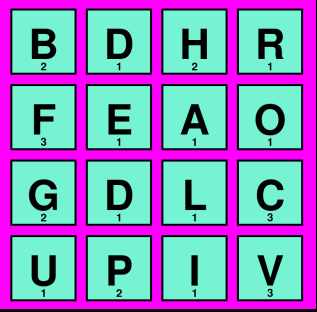
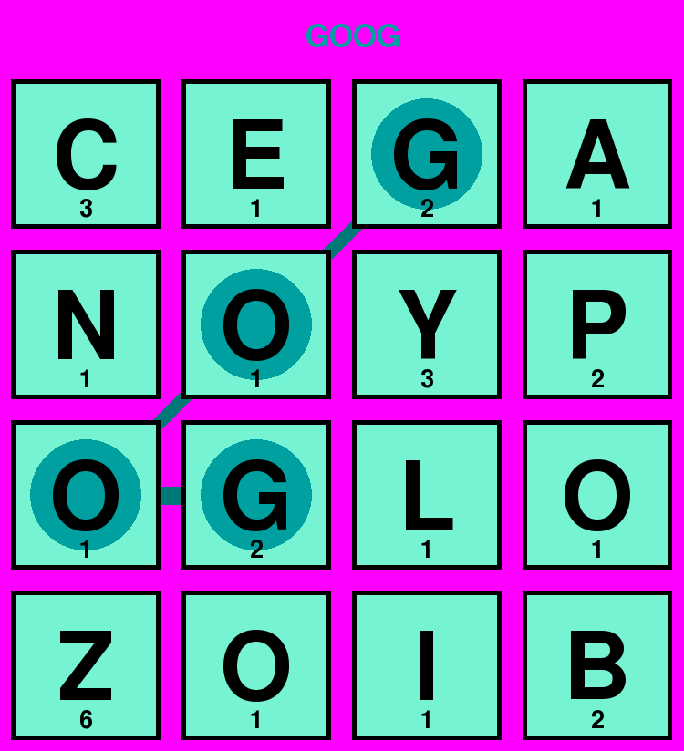

# Hidden Word Square
This is a fun word game where you try to find all of the normal words hidden in the letters.

## Reasons to play
*   **Fun challenging problems** While games might be easy, others might have you scratching your head trying to figure  out what the last few words are
*   **Colourful gameplay** There is a customizable colour theme that makes they game better suited to each player 

## How to play:
- Click on the play button
- Choose a letter and click and drag with your mouse or your finger to adjacent letters to make words. 
- Each normal word adds to the score depending on the length and which letters are in the word
- Bonus words are words that were deemed too rare to be needed to win. These words give you hints that are unlocked when you reach two thirds of the total score
- When a third of the total score is reached a hint becomes available as well as at half. You have to click on it with your mouse to reveal it
- Once the stars are unlocked, drag them onto a swuare to gets hits about the words it starts.
- When you find all of the normal words you've won. Yay!!
- To play again, refresh the page.

## How I made this
This project was made intirely in python (ignore what github is telling you, it's insane) with pygame.

## How to play
The easiest way to play the game is visiting the itch.io page at **

## Installing
If you want to install the game for some reason follow these steps. They presume that you already have python installed, and while a venv is recommended it isn't needed.

### set up the virtual environment
python -m venv .venv

source /.venv/bin/activate

*   git checkout https://github.com/LilyEllaC/HiddenWordsSquare

### install the dependencies 
pip install -r requirements.txt
python main.py

## AI 
This project used very little ai. It was used for research purposes and the autocomplete function was used before I got annoyed and turned it off only a few hours into the project. Slight bit of ai to figure out why it wasn't working for pygbag and fixing that problem